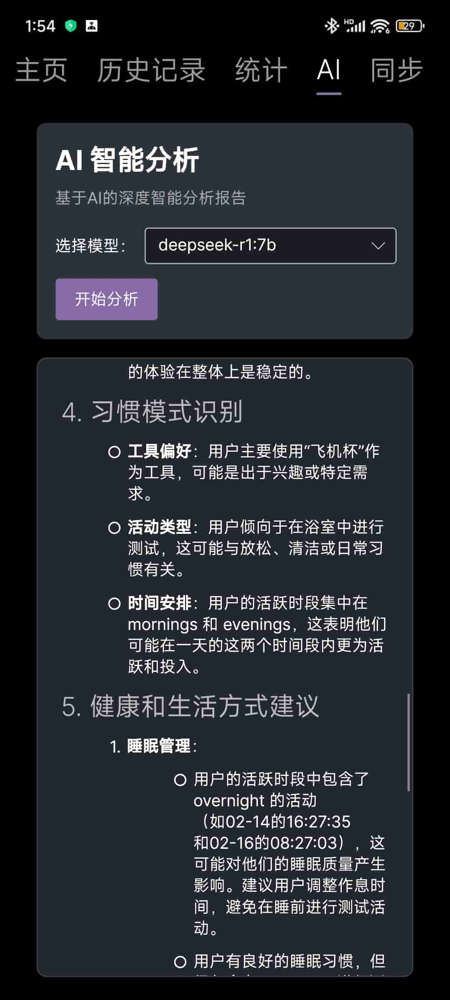
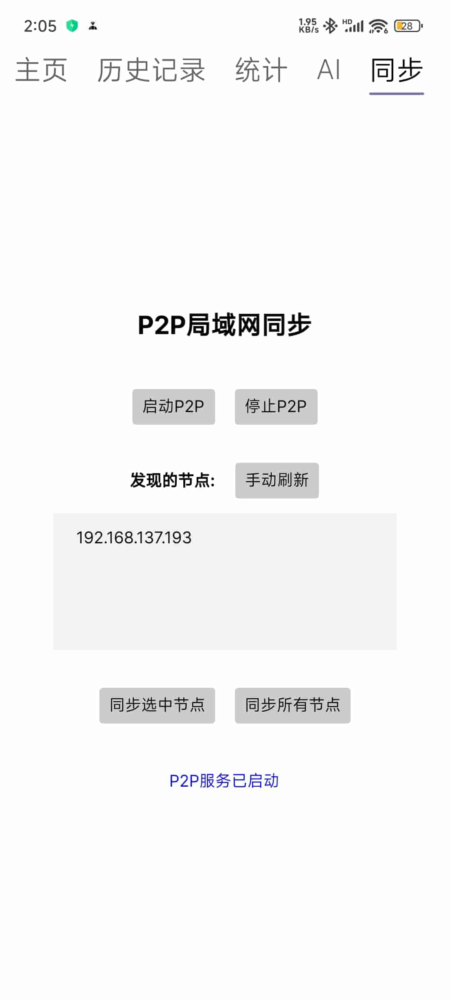
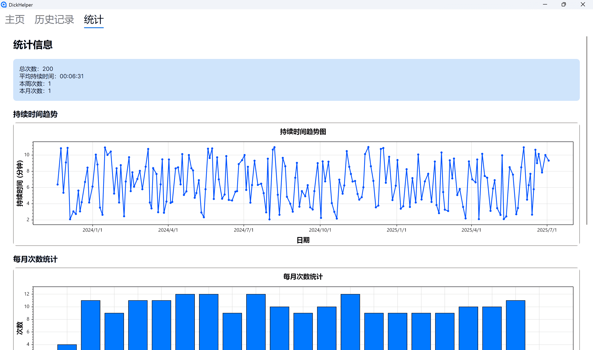
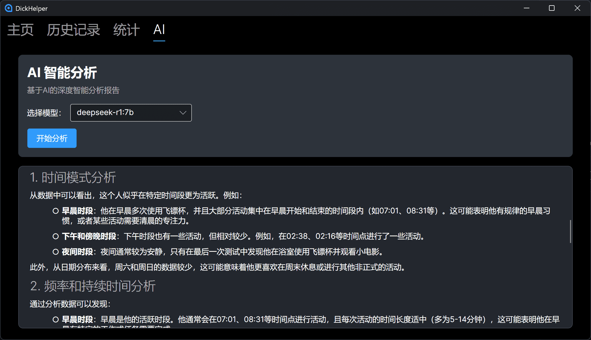

<div align="center">


# 牛子小助手

[](https://github.com/LuYifei2011/DickHelper)
<a href="https://github.com/LuYifei2011/DickHelper/releases"></a>
[](https://github.com/LuYifei2011/DickHelper/releases)
<a href="https://github.com/LuYifei2011/DickHelper/issues"></a>

一个简单、高效、易用的打飞机记录工具，帮助你科学管理✈️生活

</div>

---

## 主要特性
- 跨平台支持：桌面端、安卓端（iOS 与 Web 端计划支持）
- 基于 Avalonia 框架，MVVM 架构，易扩展维护
- 支持深色和浅色主题
- 简洁高效，易用性强
- AI 智能分析，自动生成个性化报告
- 丰富的统计与可视化图表（趋势、月/周统计等）
- 局域网同步，支持多设备数据互通

## 目录结构
- `DickHelper/`：主项目代码，包含视图(Views)、视图模型(ViewModels)等
- `DickHelper.Desktop/`：桌面端启动项目（已支持）
- `DickHelper.Android/`：安卓端启动项目（已支持）
- `DickHelper.iOS/`：iOS 端启动项目（暂未支持）
- `DickHelper.Browser/`：Web 端启动项目（暂未支持）

## 说明
本项目绝大部分代码由 GitHub Copilot 生成和辅助编写，极大提升了开发效率。

本项目参考了以下开源项目：
- [NzHelper](https://github.com/bug-bit/NzHelper)
- [DickHelper](https://github.com/zzzdajb/DickHelper)

## 联系方式
如有建议、问题或合作意向，欢迎通过 [GitHub Issues](https://github.com/LuYifei2011/DickHelper/issues) 提出，或通过 Telegram 联系 [@luyifei2011_bot](https://t.me/luyifei2011_bot)。

## 屏幕截图
<div style="display: inline-block;">








</div>

## 如何运行
1. 使用 Visual Studio 2022 或更高版本打开 `DickHelper.sln` 解决方案。
2. 选择对应的启动项目（如桌面端、安卓端等）。
3. 编译并运行。

### 生成测试数据
如需生成测试用的历史记录数据，可运行 `test_data_generator.py` 脚本，自动覆盖原有数据：

```bash
python test_data_generator.py
```

## 依赖
- .NET 6 或更高版本
- Avalonia UI

## 贡献
欢迎提交 issue 或 pull request 以改进本项目。

## 许可证 | License
GPL-3.0（GNU General Public License v3.0）

## Star History
[](https://star-history.com/#LuYifei2011/DickHelper&Timeline)

---

> 本项目绝大部分代码由 GitHub Copilot 生成。
> 
> 本文档由 GitHub Copilot 辅助编写。
