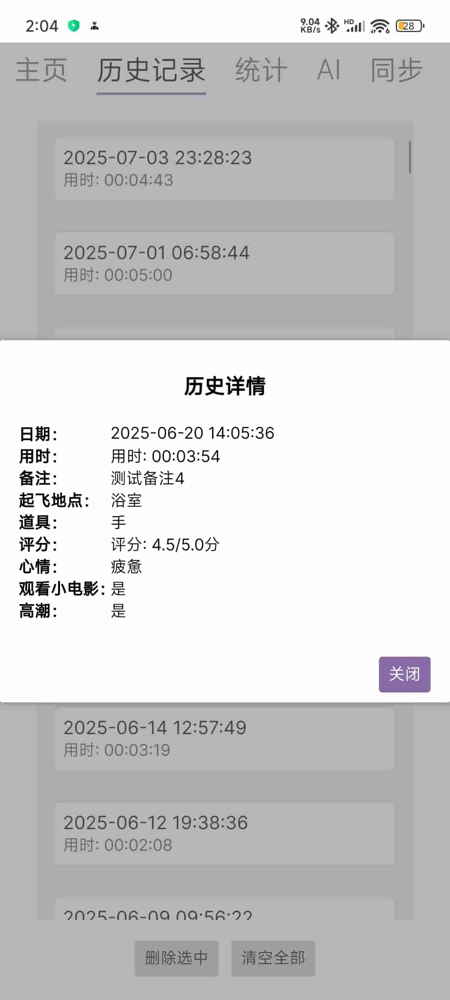

# 牛子小助手

一个简单、高效、易用的打飞机记录工具，帮助你科学管理✈️生活

---

## 主要特性
- 跨平台支持（目前仅支持桌面端和安卓端，iOS 端与 Web 端计划后续支持）
- 采用 Avalonia 框架开发
- 包含 MVVM 架构，易于扩展和维护

## 目录结构
- `DickHelper/`：主项目代码，包含视图(Views)、视图模型(ViewModels)等
- `DickHelper.Desktop/`：桌面端启动项目（已支持）
- `DickHelper.Android/`：安卓端启动项目（已支持）
- `DickHelper.iOS/`：iOS 端启动项目（暂未支持）
- `DickHelper.Browser/`：Web 端启动项目（暂未支持）

## 说明
本项目的绝大部分代码由 GitHub Copilot 生成和辅助编写，极大提升了开发效率。

本项目参考了以下开源项目：
- [NzHelper](https://github.com/LuYifei2011/DickHelper)
- [DickHelper](https://github.com/zzzdajb/DickHelper)

## 屏幕截图

## 如何运行
1. 使用 Visual Studio 2022 或更高版本打开 `DickHelper.sln` 解决方案。
2. 选择对应的启动项目（如桌面端、安卓端等）。
3. 编译并运行。

## 依赖
- .NET 6 或更高版本
- Avalonia UI

## 贡献
欢迎提交 issue 或 pull request 以改进本项目。

## 许可证 | License
GPL-3.0（GNU General Public License v3.0）

## Star History

---

> 本项目绝大部分代码由 GitHub Copilot 生成。
> 
> 本文档由 GitHub Copilot 辅助编写。
